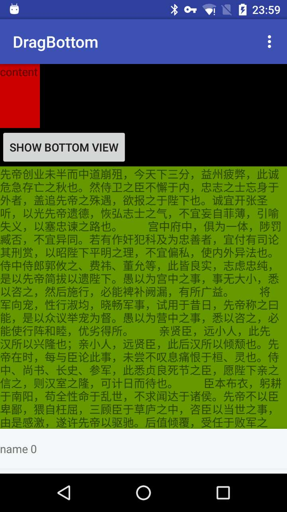

# DragBottom




##引入项目

使用AndroidStudio引入的方式
```groovy
repositories {
    jcenter()
    maven { url "https://jitpack.io" }
}

dependencies {
    compile ''
}
```

##开始使用
将自己的Layout包含在DragBottomLayout中

例如你的内容布局为
```xml
<LinearLayout
	android:id="@+id/content"
	android:orientation="vertical"
	android:layout_width="match_parent"
	android:layout_height="match_parent">

	<View
		android:id="@+id/view1"
		android:layout_width="match_parent"
		android:layout_height="match_parent"/>

</LinearLayout>
```
BottomView中的内容为
```xml
<LinearLayout
	android:id="@+id/bottom"
	android:orientation="vertical"
	android:layout_width="match_parent"
	android:layout_height="match_parent">

	<View
		android:id="@+id/view2"
		android:layout_width="match_parent"
		android:layout_height="match_parent"/>

</LinearLayout>
```

则最终的布局为
```xml
<im.hua.library.BottomDragLayout
        android:id="@+id/bdl"
        android:layout_width="match_parent"
        android:layout_height="match_parent"
        android:orientation="vertical"
        app:bottomInitialHeight="56dp"
        app:bottomViewGravity="center"
        app:finalMarginTop="48dp"
        app:shadowMaxAlpha="200">
        
  <LinearLayout
	android:id="@+id/content"
	android:orientation="vertical"
	android:layout_width="match_parent"
	android:layout_height="match_parent">
	  <View
		  android:id="@+id/view1"
		  android:layout_width="match_parent"
		  android:layout_height="match_parent"/>
  </LinearLayout>
  
  <LinearLayout
	android:id="@+id/bottom"
	android:orientation="vertical"
	android:layout_width="match_parent"
	android:layout_height="match_parent">
	  <View
		  android:id="@+id/view2"
		  android:layout_width="match_parent"
		  android:layout_height="match_parent"/>
  </LinearLayout>
  
</im.hua.library.BottomDragLayout>
```
###注意事项
- `BottomDragLayout`中有且只能包含`两个`子`View`或者`ViewGroup`
- `ContentView`中的布局和平时一样使用即可
- `BottomView`目前支持`RecyclerView`、`WebView`、`ScrollView`、`ListView`、`GridView`的滚动，对于其他ViewGroup或者View则按正常情况处理

除了可以通过拖动BottomView来显示BottomView，也可以通过方法
```java
showBottomView()
hideBottomView()
```
来控制BottomView的显示和隐藏

---

##自定义属性
| 属性名              | 含义                  | 取值  |
| -------------       |:-------------:        | -----:|
| shadowMinAlpha      | 背景阴影的最小透明度  | 0 ~ 255，并且小于shadowMaxAlpha|
| shadowMaxAlpha      | 背景阴影的最大透明度  | 0 ~ 255，并且大于shadowMinAlpha|
| bottomViewGravity   | BottomView的对其方式  | left|center|right |
| finalMarginTop      | BottomView展开时距离父容器顶部的距离              |    dimension|reference |
| bottomInitialHeight | 初始化时，BottomView在底部展示的高度              |    dimension|reference |

